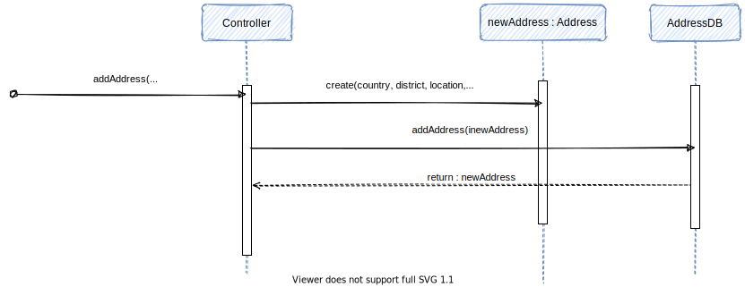
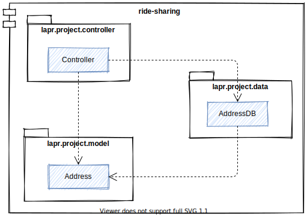

# **Aluno [1171317](../)** - US-4 - Associar uma Morada e respetivas coordenadas GPS ao registo de um novo Cliente

# 1. Requisitos

_Nesta secção o estudante deve indicar a funcionalidade desenvolvida bem como descrever a sua interpretação sobre a mesma e sua correlação e/ou dependência de/com outros requisitos._

**US-4** 
As a non-registered user, 
I want to be able to provide a home address and GPS location 
so that I may receive deliveries at the designated address. 

De acordo com o caderno de encargos e com as respostas dadas no Fórum para Esclarecimento de Requisitos (perspetiva de cliente do sistema), contido na página de LAPR3, foram identificadas as seguintes **regras de negócio**:

# 2. Análise

_Neste secção o estudante deve relatar o estudo/análise/comparação que fez com o intuito de tomar as melhores opções de design para a funcionalidade bem como aplicar diagramas/artefactos de análise adequados._

Esta US complementa a **US-3 Adicionar informação pessoal ao registo de Cliente**. De acordo com o Modelo de Dominio (MD), temos uma entidade responsavel pela morada e respetivas coordenadas GPS. Esta entidade estará por sua vez associada à entidade Cliente. A par a criação da entidade de Negocio em Java, a presente US é também responsável pela implementação de quaiquer funções/procedimentos/triggers, agora em PLSQL, que permitam a execução dos comportamentos requiridos nesta Story. 

## 2.1. Diagrama de Casos de Uso (UCD)

# 3. Design

_Nesta secção o estudante deve descrever o design adotado para satisfazer a funcionalidade. Entre outros, o estudante deve apresentar diagrama(s) de realização da funcionalidade, diagrama(s) de classes, identificação de padrões aplicados e quais foram os principais testes especificados para validar a funcionalidade._

_Para além das secções sugeridas, podem ser incluídas outras._

## 3.1. Realização da Funcionalidade (SD)

_Nesta secção deve apresentar e descrever o fluxo/sequência que permite realizar a funcionalidade._

## 3.2. Diagrama de Classes (CD)

_Nesta secção deve apresentar e descrever as principais classes envolvidas na realização da funcionalidade._

## 3.3. Modelo Relacional (RM)

# 4. Implementação

_Nesta secção o estudante deve providenciar, se necessário, algumas evidências de que a implementação está em conformidade com o design efetuado. Para além disso, deve mencionar/descrever a existência de outros ficheiros (e.g. de configuração) relevantes e destacar commits relevantes;_

_Recomenda-se que organize este conteúdo por subsecções._

## 4.1. Testes

_Nesta secção deve sistematizar como os testes foram concebidos para permitir uma correta aferição da satisfação dos requisitos._

**Teste 1:** Verificar que não é possível criar uma instância da classe X com valores nulos.

    ...

## 4.2. Código

# 5. Integração

_Nesta secção o estudante deve descrever os esforços realizados no sentido de integrar a funcionalidade desenvolvida com as restantes funcionalidades do sistema._

# 6. Observações

_Nesta secção sugere-se que o estudante apresente uma perspetiva critica sobre o trabalho desenvolvido apontando, por exemplo, outras alternativas e ou trabalhos futuros relacionados._
