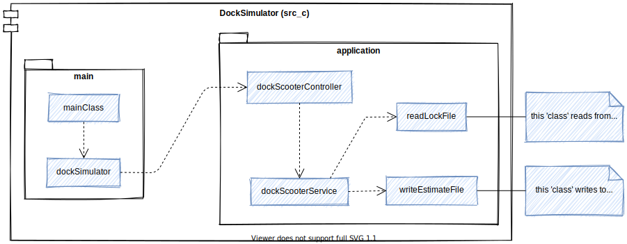

# **Aluno [1171317](../)** - US-78 - Estimate Time For Full Charge
# 1. Requisitos

_Nesta secção o estudante deve indicar a funcionalidade desenvolvida bem como descrever a sua interpretação sobre a mesma e sua correlação e/ou dependência de/com outros requisitos._

**US-78** 
As a Courier 
I want to be able to park/dock the electric scooter assigned to me 
so that I can lock it and leave it to recharge.  

De acordo com o caderno de encargos e com as respostas dadas no Fórum para Esclarecimento de Requisitos (perspetiva de cliente do sistema), contido na página de LAPR3, foram identificadas as seguintes **regras de negócio**:

# 2. Análise

_Neste secção o estudante deve relatar o estudo/análise/comparação que fez com o intuito de tomar as melhores opções de design para a funcionalidade bem como aplicar diagramas/artefactos de análise adequados._

Esta US implica o desenvolvimento de uma nova **aplicação, em C, com modulos em Assembly**, com o objetivo de **simular um estacionamento de uma Scooter** e o inicio do seu carregamento. Apesar de ser um novo componente, independente do sistema central, o desenvolvimento desta aplicação, agora em C, procurou aplicar os mesmos principios e normas de Design normalmente aplicados em Java. Ora, uma vez que C não é orientado a objetos, algumas liberdades foram tomadas ao nivel da implementação de forma a produzir um produto concistente com o Design.

Esta US fica também responsavel pela criação dos diretórios para leitura e escrita, respetivamente, bem como pela definição da formatação dos ficheiros.

## 2.1. Diagrama de Casos de Uso (UCD)

# 3. Design

_Nesta secção o estudante deve descrever o design adotado para satisfazer a funcionalidade. Entre outros, o estudante deve apresentar diagrama(s) de realização da funcionalidade, diagrama(s) de classes, identificação de padrões aplicados e quais foram os principais testes especificados para validar a funcionalidade._

_Para além das secções sugeridas, podem ser incluídas outras._

## 3.1. Realização da Funcionalidade (SD)

_Nesta secção deve apresentar e descrever o fluxo/sequência que permite realizar a funcionalidade._

## 3.2. Diagrama de Classes (CD)

_Nesta secção deve apresentar e descrever as principais classes envolvidas na realização da funcionalidade._

## 3.3. Modelo Relacional (RM)

Não se verificou qualquer necessidade de persistencia no desenvolvimento da presente aplicação em C.

# 4. Implementação

_Nesta secção o estudante deve providenciar, se necessário, algumas evidências de que a implementação está em conformidade com o design efetuado. Para além disso, deve mencionar/descrever a existência de outros ficheiros (e.g. de configuração) relevantes e destacar commits relevantes;_

_Recomenda-se que organize este conteúdo por subsecções._

## 4.1. Testes

_Nesta secção deve sistematizar como os testes foram concebidos para permitir uma correta aferição da satisfação dos requisitos._

**Teste 1:** Verificar que não é possível criar uma instância da classe X com valores nulos.

    ...

## 4.2. Código

# 5. Integração

_Nesta secção o estudante deve descrever os esforços realizados no sentido de integrar a funcionalidade desenvolvida com as restantes funcionalidades do sistema._

# 6. Observações

_Nesta secção sugere-se que o estudante apresente uma perspetiva critica sobre o trabalho desenvolvido apontando, por exemplo, outras alternativas e ou trabalhos futuros relacionados._
