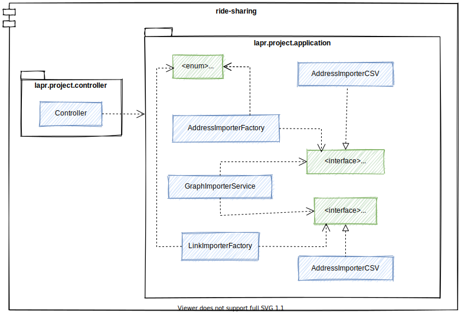

# **Aluno [1171317](../)** - US-34 - Importar grafo a partir de ficheiros CSV

# 1. Requisitos

_Nesta secção o estudante deve indicar a funcionalidade desenvolvida bem como descrever a sua interpretação sobre a mesma e sua correlação e/ou dependência de/com outros requisitos._

**US-34** 
As an Administrator,
I want the system to be able to read address and roads from CSV files
so that I can have a 'map' with all the possible paths

De acordo com o caderno de encargos e com as respostas dadas no Fórum para Esclarecimento de Requisitos (perspetiva de cliente do sistema), contido na página de LAPR3, foram identificadas as seguintes **regras de negócio**:

# 2. Análise

_Neste secção o estudante deve relatar o estudo/análise/comparação que fez com o intuito de tomar as melhores opções de design para a funcionalidade bem como aplicar diagramas/artefactos de análise adequados._

Esta US dependente da **TASK-170 Establish vertex file and edges files format & Create Files**, uma vez que serão estes os ficheiros a serem lidos por esta US, de forma a construir o grafo. Quando à implementação, esta é precedida pela criação de uma nova entidade, Link, não de negócio, responsável por guardar atributos que classificam as condições de um segmento entre duas moradas. 

## 2.1. Diagrama de Casos de Uso (UCD)

# 3. Design

_Nesta secção o estudante deve descrever o design adotado para satisfazer a funcionalidade. Entre outros, o estudante deve apresentar diagrama(s) de realização da funcionalidade, diagrama(s) de classes, identificação de padrões aplicados e quais foram os principais testes especificados para validar a funcionalidade._

_Para além das secções sugeridas, podem ser incluídas outras._

## 3.1. Realização da Funcionalidade (SD)

_Nesta secção deve apresentar e descrever o fluxo/sequência que permite realizar a funcionalidade._

## 3.2. Diagrama de Classes (CD)

_Nesta secção deve apresentar e descrever as principais classes envolvidas na realização da funcionalidade._

## 3.3. Modelo Relacional (RM)

Não se verificou qualquer necessidade de persistencia no desenvolvimento da presente US.

# 4. Implementação

_Nesta secção o estudante deve providenciar, se necessário, algumas evidências de que a implementação está em conformidade com o design efetuado. Para além disso, deve mencionar/descrever a existência de outros ficheiros (e.g. de configuração) relevantes e destacar commits relevantes;_

_Recomenda-se que organize este conteúdo por subsecções._

## 4.1. Testes

_Nesta secção deve sistematizar como os testes foram concebidos para permitir uma correta aferição da satisfação dos requisitos._

**Teste 1:** Verificar que não é possível criar uma instância da classe X com valores nulos.

    ...

## 4.2. Código

# 5. Integração

_Nesta secção o estudante deve descrever os esforços realizados no sentido de integrar a funcionalidade desenvolvida com as restantes funcionalidades do sistema._

# 6. Observações

_Nesta secção sugere-se que o estudante apresente uma perspetiva critica sobre o trabalho desenvolvido apontando, por exemplo, outras alternativas e ou trabalhos futuros relacionados._
